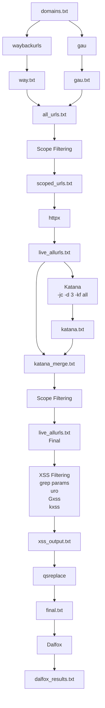

## get-urls
> Automated URL discovery and XSS reconnaissance pipeline using waybackurls, gau, httpx, katana, Gxss, kxss, uro, and Dalfox.

# X-ploit URL Recon Pipeline

## Workflow



## Files Generated

| File | Description |
|------|-------------|
| `way.txt` | First stage - URLs gathered from waybackurls |
| `gau.txt` | Second stage - URLs gathered from gau |
| `all_urls.txt` | Merge of way.txt + gau.txt (unique URLs) |
| `scoped_urls.txt` | URLs filtered to only targets inside scope |
| `live_allurls.txt` | Alive URLs after httpx check |
| `katana.txt` | New URLs discovered by Katana crawling |
| `live_allurls.txt` | Final live URL list after merging Katana results |

## Pipeline

```
Waybackurls + GAU
        |
        v
   URL Collection
        |
        v
   Scope Filtering
        |
        v
      httpx
        |
        v
     Katana
        |
        v
 Parameter Discovery
        |
        v
     Dalfox
        |
        v
    XSS Results
```
