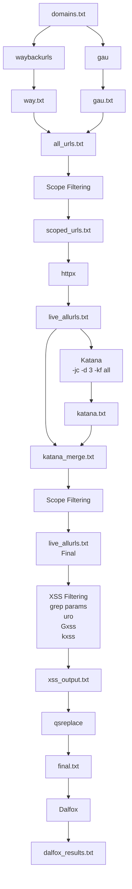

## get-urls

# X-ploit URL Recon Pipeline

## Workflow



## Files Generated

| File | Description | Lines |
|------|-------------|------:|
| `way.txt` | URLs from waybackurls | 22371 |
| `gau.txt` | URLs from gau | 10542 |
| `all_urls.txt` | Unique URLs from waybackurls + gau | 22371 |
| `scoped_urls.txt` | URLs filtered to target scope | 22338 |
| `live_allurls.txt` | Live URLs after httpx | 13379 |
| `katana.txt` | URLs discovered by Katana crawling | 240093 |
| `final.txt` | URLs ready for Dalfox | - |
| `dalfox_results.txt` | XSS scan results | - |

## Pipeline

```
Waybackurls + GAU
        |
        v
   URL Collection
        |
        v
   Scope Filtering
        |
        v
      httpx
        |
        v
     Katana
        |
        v
 Parameter Discovery
        |
        v
     Dalfox
        |
        v
    XSS Results
```
